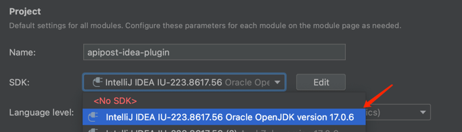
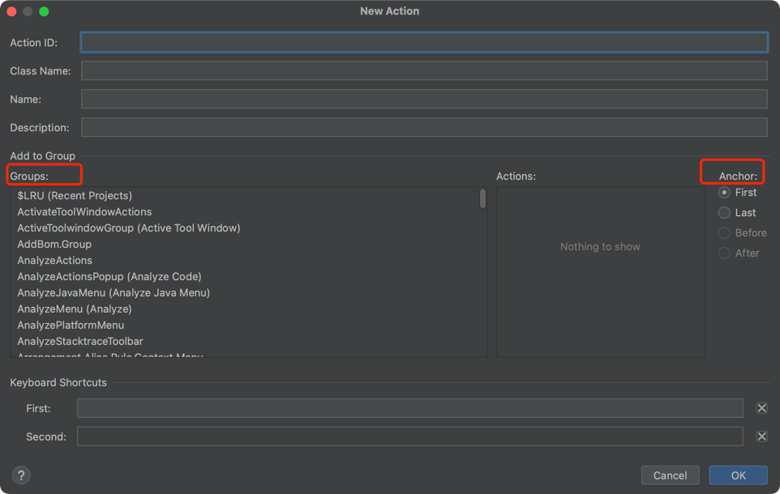
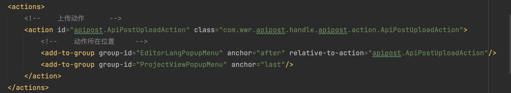

## 介绍
- 解析接口数据同步到远程

## 安装
- 使用压缩包安装
- 插件市场搜索安装

## 开发
- sdk：必须使用idea的sdk，

- action：动作，可自定义，右键新建即可新建一个动作

> 动作就是按钮，你要点击后触发什么操作就在`Action`类中的`handle`方法中实现

- action所在位置，groups和anchor配合使用，groups是分组，anchor是在分组中的位置
- 动作配置：在plugin.xml中配置，配置的是动作的名称，描述，图标等
  