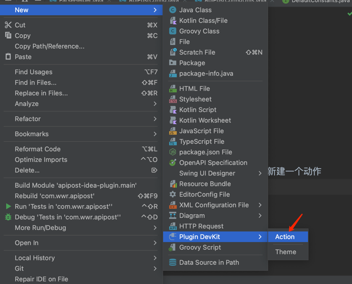

## 介绍
- Apipost IDEA 插件 「Apipost IDEA Helper」现已开源 ！自动解析注解、快速同步文档、高效协作，现在只需一个「Apipost IDEA Helper」！
- 同时，Apipost发起召集牛逼的Java攻城狮活动！一起自创 IDEA插件，贡献代码即可获得精美礼品，更有机会获得妙控键盘！（活动详情请阅读整个内容）

- Apipost IDEA Helper 集成在于IDEA 中，基于 javadoc（Java）、KDoc（Kotlin）、ScalaDoc（Scala）解析 API 文档。在后端研发完成API编写后，只需在IDEA中右键点击“Upload to Apipost”，即可快速生成完整的API文档并同步到Apipost项目中，无需导出操作。

- 召集牛逼的Java攻城狮，教你做自己的IDEA插件

## 如何安装
- 下载插件：（目前支持21.3以上版本安装使用哦）

链接：https://pan.baidu.com/s/1XXKnB-OzBkXjis31bb0Ofw
提取码：post
- 使用压缩包安装

- 配置方法

安装成功后要将 IDEA 内的项目与 Apipost的项目进行关联。在Apipost 「项目设置」>「对外能力」>「open API」中复制 API-token、项目ID，再进入IDEA设置界面 >「Apipost Config」 中填写 API-token、项目ID。

如遇到云端地址没有或者不对情况，请填写：https://sync-project.apipost.cn/api/convert

- 上传文件

后端研发在API代码编写、代码修改后右键点击“Upload to Apipost”，其他团队成员即可在 Apipost 中看到同步后的最新API文档，免去API设计环节。

## 如何开发
- IDEA官网插件文档：https://plugins.jetbrains.com/docs/intellij/basic-action-system.html
- 视频教程链接：https://b23.tv/DuuDW6E

- sdk：必须使用idea的sdk，

- action：动作，可自定义，右键新建即可新建一个动作

> 动作就是按钮，你要点击后触发什么操作就在`Action`类中的`handle`方法中实现

- action所在位置，groups和anchor配合使用，groups是分组，anchor是在分组中的位置
- 动作配置：在plugin.xml中配置，配置的是动作的名称，描述，图标等
  
  
- 开发文档

导入目录文档：https://console-docs.apipost.cn/preview/38ff26b7bfddc906/3f7ac8ce1fdfe8d0 

## 问题反馈
- 现存问题：

1、暂时不支持按目录导入----已修复，可在IDEA中新建目录导入，感谢Java攻城狮~JouTao

2、暂时不支持21.2以前版本安装，版本兼容问题

3、Api导入URL没有拼域名

4、项目ID不能保存----已修复，感谢Java攻城狮~Zhuoyuan1 

5、暂时不支持导入Apipost已存在的目录中

- 以上是我们个人使用用户反馈，欢迎牛逼的Java攻城狮，一起完善好产品，做出自己的IEDA插件，让开发测试更简单；
## 联系我们
- 活动规则：

1、提交自己设计的IDEA插件功能；

2、提交修复Pr BUG；

Apipost官方审核通过合并后，即为参与成功；

- 活动详情与报名，请扫码二维码↓

   
 ## 进度更新
 - 已提交的Java攻城狮们，点击这里登记提交您的信息哦，我们会在进度中更新，审核合并后，会在特别鸣谢中公示；
 - 信息登记：https://api-scrm-client.wxb.com/ques/auth?ques_code=8KU43PA1
 
 - 2023/05/26 发布：合并Pr项目ID不能保存的问题----感谢Java攻城狮~Zhuoyuan1 
 - 2023/05/31 发布：支持IDEA中新建目录导入的问题，已确认待合并----感谢Java攻城狮~JouTao
   
 ## 特别鸣谢
